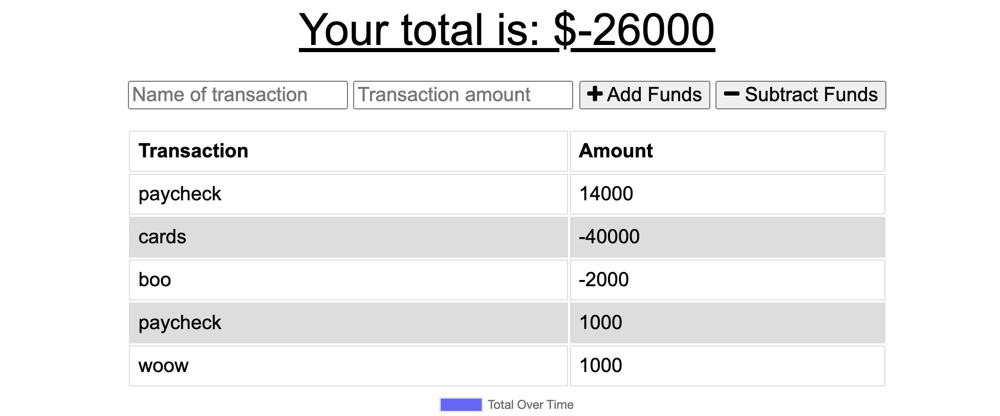
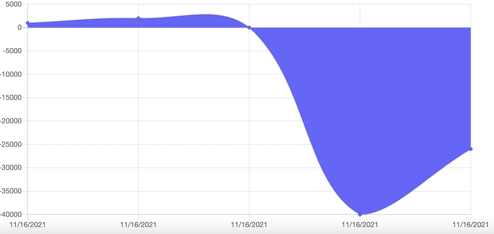

# Progressive Budget 
## About

This website allows you to track your budget and purchases, online and offline.

## Description

On page load, you are able to see input areas for products and then choose to `Add funds` or `Subtract funds` from your budget. After you have inputted your item, you can see it load onto the page in the form of a graph which allows for the user to see their budget holistically. 

## Table of Contents
* [Deployment](#deployment)
* [Installation](#installation)
* [Usage](#usage)
* [Contributing](#contributing)
* [Tests](#tests)
* [License](#license)
* [Questions](#questions)

## Deployment
Check out the site here:

    - https://kelliekumasaka-budget.herokuapp.com/

## Installation
Run `npm i` to install `mongoose`, `express`, `compression`, `morgan`, and `lite-server`.

## Usage

## Contributing

## Tests

## License
This project is licensed under MIT.

## Questions
Here is a link to my [GitHub](https://github.com/kelliekumasaka) or shoot me an [email](mailto:kelliek3@gmail.com).